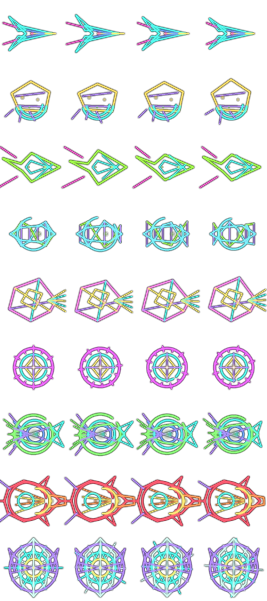
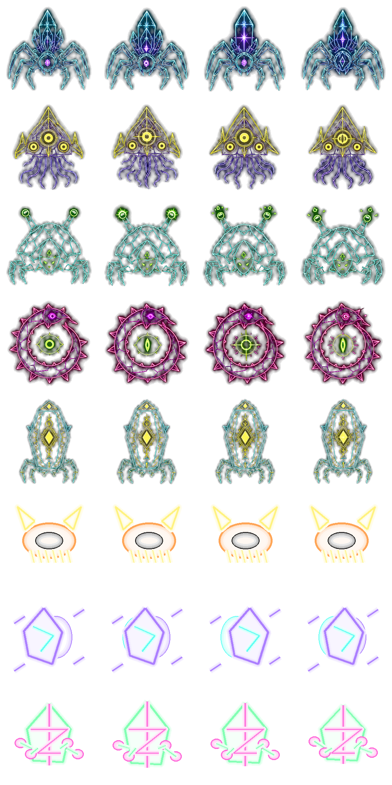
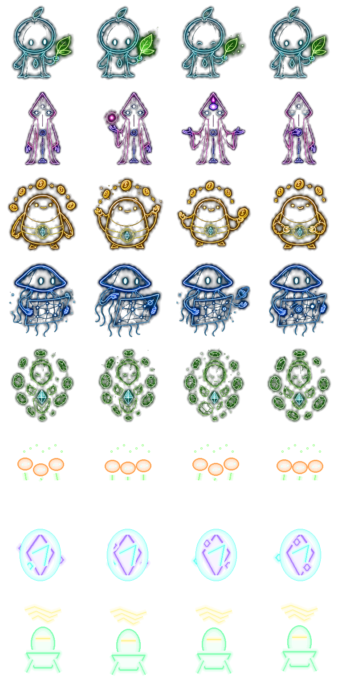

# Enemy And Alien Catalog

This is the living roster log for hostile space vectors, planet surface threats, boss catalog creatures, and friendly alien contacts.

The source of truth for numeric space enemy stats is `src/game-balance.ts`. Movement and attack personalities live in `src/space-enemy-behavior.ts`, route recipes live in `src/sector-map.ts`, and surface alien/boss rows live in `src/surface-balance.ts`.

## Space Sprite Atlas

`src/assets/space-enemy-catalog-alpha.png` is a 4-frame atlas. Each row is one sprite-backed open-space enemy.

| Row | Enemy | Role | Behavior Notes |
| ---: | --- | --- | --- |
| 0 | `razor` | Fast ambusher | Strafes hard around the player, then side-dashes with cyan trails. |
| 1 | `skimmer` | Wavy gunship | Holds range, snakes across the approach vector, fires a three-shot spread. |
| 2 | `shard` | Fast angular alien | Very fast, jagged, cornering ambusher with sudden forward and side impulses. |
| 3 | `helix` | Corkscrew alien | Spirals around range bands and fires paired spike lanes. |
| 4 | `prism` | Refraction alien | Orbits at mid-range and emits a five-beam fan. |
| 5 | `bulwark` | Heavy rotating guard | Slow shield-like body, radial projectile bursts. |
| 6 | `siphon` | Giant vortex boss | Boss-class spiral projectile arms. |
| 7 | `dreadnought` | Giant broadside boss | Heavy forward volley plus rear pressure shots. |
| 8 | `cathedral` | Giant lattice boss | Late-run boss with layered lattice rings and aimed beams. |

## Space Enemy Log

| Enemy | Render | Role | First Pressure |
| --- | --- | --- | --- |
| `chaser` | Vector glyph | Basic pursuer and early pressure unit. | Start |
| `splinter` | Vector glyph | Faster light pursuer that can split into child enemies on death. | 25s |
| `lancer` | Vector glyph | Charge attacker that punishes close passes. | 55s |
| `mine` | Vector glyph | Slow wobbling proximity hazard. | 100s |
| `shooter` | Vector glyph | Range holder with aimed shots and later spread pressure. | 120s |
| `brute` | Vector glyph | Durable close-range body blocker. | 180s |
| `warden` | Vector glyph | Elite cache/route guardian with radial fire. | Route/special |
| `razor` | Sprite row 0 | Fast hunter-wing ambusher. | 205s |
| `skimmer` | Sprite row 1 | Ranged ambush flyer. | 165s |
| `shard` | Sprite row 2 | Fast angular alien added for stranger galaxy pressure. | 145s |
| `helix` | Sprite row 3 | Corkscrew projectile alien. | 225s |
| `prism` | Sprite row 4 | Strange fan-shot alien. | 250s |
| `bulwark` | Sprite row 5 | Heavy ambush guard. | 270s |
| `siphon` | Sprite row 6 | Giant vortex boss. | 330s |
| `dreadnought` | Sprite row 7 | Giant broadside boss. | 420s |
| `cathedral` | Sprite row 8 | Final-tier lattice boss. | 560s |

## Open-Space Encounter Log

| Encounter | Spawned Threats | Route Bias |
| --- | --- | --- |
| `meteorFront` | Drifting asteroid wall. | Asteroid belts and strange/relic/lore space. |
| `asteroidField` | Procedural drifting asteroid pocket that keeps seeding around the player for a short window. | Asteroid belts, boss gates, and other asteroid-tagged routes. |
| `hunterWing` | `razor`, `shard`, `lancer`, `razor`, `skimmer`. | Hostile routes and ambush wave orders. |
| `derelictCache` | Chest signal guarded by `mine`, `shooter`, `brute`. | Cache, repair, and greed routes. |
| `alienBloom` | Ring of `helix`, `shard`, `prism`, `shard`, `helix`, `prism`. | Nebula anomalies, strange worlds, relic/lore routes. |

Asteroid fields use the same collision hazard renderer as meteor fronts, but play differently: the field lasts long enough that the player has to steer through scattered rocks, and ship fire can break larger asteroids into smaller drifting chunks.

## Planet Boss Atlas

| Row | Boss | Behavior | Notes |
| ---: | --- | --- | --- |
| 0 | Glass Crown Titan | `chaser` | Boss-class biosignal. |
| 1 | Cinder Bell Maw | `chaser` | Boss-class biosignal. |
| 2 | Verdant Needle Saint | `chaser` | Boss-class biosignal. |
| 3 | Static Brood Queen | `chaser` | Boss-class biosignal. |
| 4 | Pale Cathedral Leech | `chaser` | Boss-class biosignal. |
| 5 | Halo Grazer | `orbiter` | Orbiting predator biosignal. |
| 6 | Phase Skipper | `blinker` | Phase-jump predator biosignal. |
| 7 | Brood Prism | `splitter` | Fracturing predator biosignal. |

## Surface Threat Log

| Threat | Source | Behavior |
| --- | --- | --- |
| Surface Crawler | Standard surface telemetry. | Common hostile biosignal near caches. |
| Swarm Skitterer | Swarm/hostile planet events. | Faster surface lifeform for bad planets. |
| Horde Larva | Horde vault planets. | Small hostile guarding large treasure spills. |
| Cathedral Sentinel | NULL CATHEDRAL. | Special surface guardian. |
| Glass Mite Oracle | Strange worlds. | Rare crystalline oracle form. |
| Planet Boss rows 0-7 | Boss catalog telemetry. | Generated large creatures with `chaser`, `orbiter`, `blinker`, or `splitter` motion. |

## Friendly Alien Atlas

| Row | Alien Contact | Gift Theme |
| ---: | --- | --- |
| 0 | THE GLASS HERBALIST | `herb` |
| 1 | A STATIC PILGRIM | `idol` |
| 2 | THE COIN KEEPER | `coin` |
| 3 | THE STAR MAPMAKER | `map` |
| 4 | THE STATION WIDOW | `beacon` |
| 5 | THE SPORE CHOIR | `herb` |
| 6 | THE MIRROR DRIFTER | `map` |
| 7 | THE SINGING ENGINE | `beacon` |

Friendly aliens are not ordinary enemies. They are one-time surface contacts: the player can refuse or accept a gift roll. Good rolls repair, reveal, enrich, or grant rare rewards. Bad rolls can damage the pilot, steal resources, reduce oxygen, or wake hostile things.
